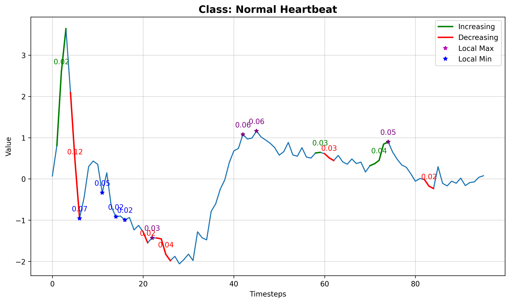

# Interpreting Black-Box Time Series Classifiers using Parameterised Event Primitives

We propose LOcal Model Agnostic Time series Classification Explanation (LOMATCE, pronounced "lom-te-see"), a method akin to LIME [1], to explain deep-learning-based time series classifiers. LOMATCE uses parametrized event primitives (PEPs) to extract and parameterize events like increasing trends, decreasing trends, local maxima, and local minima from time series data. These PEPs capture temporal patterns, and facilitating the training of simple, interpretable models like linear regression [2]. Discussing time series in terms of these familiar events makes the explanations more intuitive and comprehensible.

## File description

- experiments: This directory contains code files and results.

  - results: Includes experiment results for each dataset.

    - output.log:This file contains the fidelity scores for each dataset and perturbation strategy.

    * Example: Evaluation result for FCN model architecture trained on the ECG dataset and zero perturbation strategy can be found at `experiments\results\simulation\ecg200\fcn-zero--2024-04-22_22-04-47\output.log.`

## Method Design

<!--  -->


**Fig 1:** The proposed XAI method for DL based time series classifiers using Parameterised Event Primitives (PEPs).

## Result

##### Table **1**: Explanation faithfulness, with 95% confidence interval, across various perturbation methods.

|   Dataset    |      Zero       |      Mean       |   Total_mean    |     Random      |
| :----------: | :-------------: | :-------------: | :-------------: | :-------------: |
|   **ECG**    | $0.82 \pm 0.02$ | $0.70 \pm 0.02$ | $0.81 \pm 0.01$ | $0.54 \pm 0.10$ |
| **GunPoint** | $0.72 \pm 0.02$ | $0.52 \pm 0.03$ | $0.75 \pm 0.08$ | $0.75 \pm 0.08$ |


**Fig 2:** Explanation highlights segment significance, relevance scores, and event types (e.g., increasing, decreasing, maxima, minima).

## Usage

To run the the simulation of the experiment, use the following command:

- For FCN model

```
python fcn_simulation --dataset [dataset-name] --num_runs [100 ]  --class_labels [list of the class names]
```

## Requirments

- tsai (State-of-the-art Deep Learning library for Time Series and Sequences)
- python >= 3.8
- pytorch

## References

- [1] [" Why Should I Trust You?" (Ribeiro 2016)](https://dl.acm.org/doi/abs/10.1145/2939672.2939778)
- [2] [Learning Comprehensible Descriptions of Multivariate Time Series (Kadous, 1999)](https://www.researchgate.net/profile/Mohammed-Kadous/publication/2300384_Learning_Comprehensible_Descriptions_of_Multivariate_Time_Series/links/0c960523afe0537bb7000000/Learning-Comprehensible-Descriptions-of-Multivariate-Time-Series.pdf)
